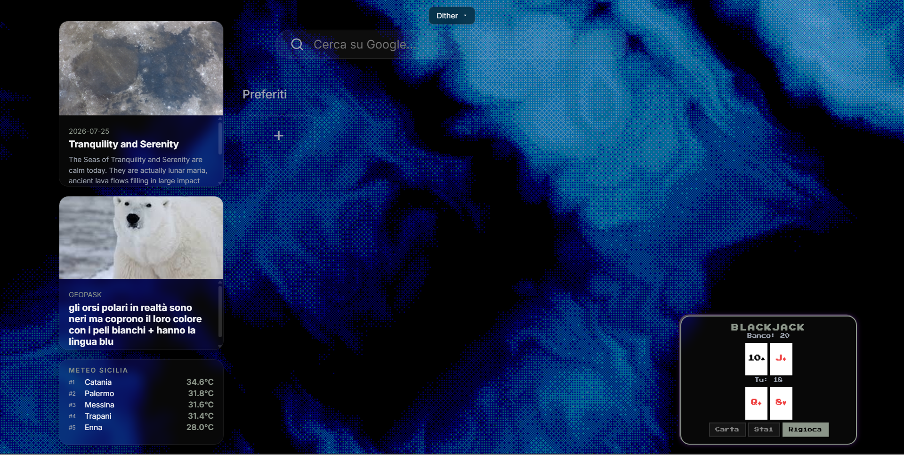

# Pulsandola

This is a project that was made using HTML, CSS, JS, React and some AI (Deepseek v4 Flash). It started as a simple homepage with a NASA APOD widget and turned into a full dashboard with bookmarks, animal facts that my friend always says, blackjack, weather and customizable backgrounds. 

https://pickledroided.github.io/pulsandola/

---

## Preview

---

## The Idea

started from the stardance mission to give a pulse to a website and it was a random thing at first that i didn't really like but when i began to understand how APIs and requests worked i started to actually enjoy making it and rn im having a lot of fun building it and giving life to my dumb ideas (Such as the blackjack minigame). still got a lot of work to do tho but i'm getting there :> 

## Credits

- Shoutout to DeepSeek v4 FLASH for helping when the code didn't work and all the times the apis didn't work (hopefully they work now)
- [Reactbits](https://reactbits.dev) for the Dither and galaxy background
- [DietrichGebert/ponytail](https://github.com/DietrichGebert/ponytail) for keeping the code minimal
- NASA for the APOD API
- The **Stardance** community for the opportunity :3
